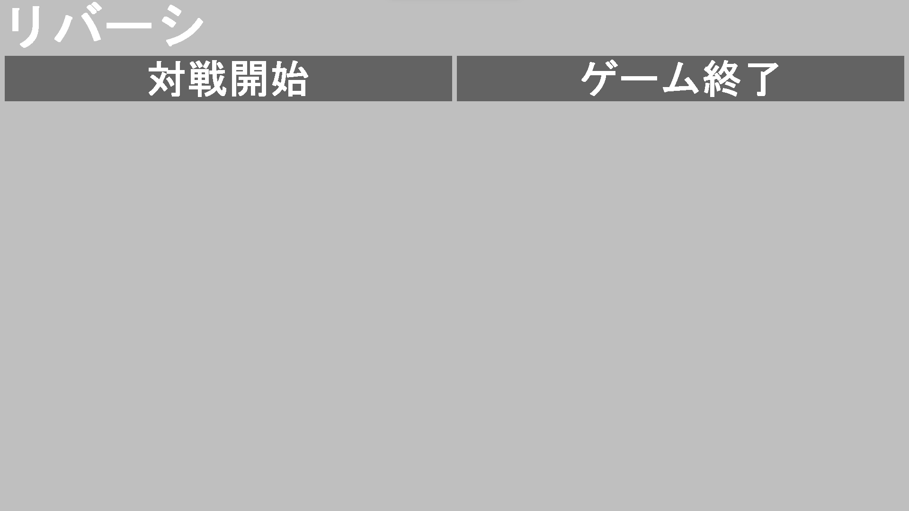

# ReversiConsole
- GUIのリバーシでAIと対戦できるゲーム
# 特徴
- AIはモンテカルロ木探索を行う（強さ：まあまあ強い）
- クリックだけでプレイできる
- 色々な大きさのモニターでも画面が崩れない
# 工夫
## モンテカルロ木探索（UCB1-Tuned）
各ターンの盤面を根とするゲーム木をランダムプレイアウトによって探索していくアルゴリズム．結構強い
## ビットボード
リバーシをビットボードで実装した．

メリット
- 省メモリ：盤面状態を16[byte]で保存できる
- 高速動作：ビット演算による盤面の操作．これのおかげでモンテカルロ木探索のプレイアウト回数爆増
## プールアロケータ
モンテカルロ木探索では，毎ターン大量に盤面状態を保存するノードが生成される．
これを管理するためにプールアロケータを実装した．

メリット
- 高速動作1：メモリの確保が試合開始時のみで良くなった
- 高速動作2：ノード生成の度に行っていたメモリ確保がなくなり，モンテカルロ木探索が高速動作るようになった
# 次作るときの目標
## AIをマルチスレッドで動かす
今回はAIが思考している間は描画の更新は行っていない（処理落ち）
## モンテカルロ木探索の強化
ターン間の探索木の受け渡しや選択ポリシー関数の変更，ハイパーパラメータの調整等やれることはまだある
## もっと細かいAIの設定
モンテカルロ木探索のハイパーパラメータ（探索係数C，展開の閾値，探索時間，アロケータの確保メモリ量）をゲームプレイヤーが設定できるようにする．
## アロケータの高機能化
プールアロケータを実装する際に各メモリブロックにデバッグ情報を付与する，アロケータの空間的局所参照性を上げるための並べ替え等工夫できそう．
## デザイン
もっと使いやすく，もっとカッコよく
# スクリーンショット

